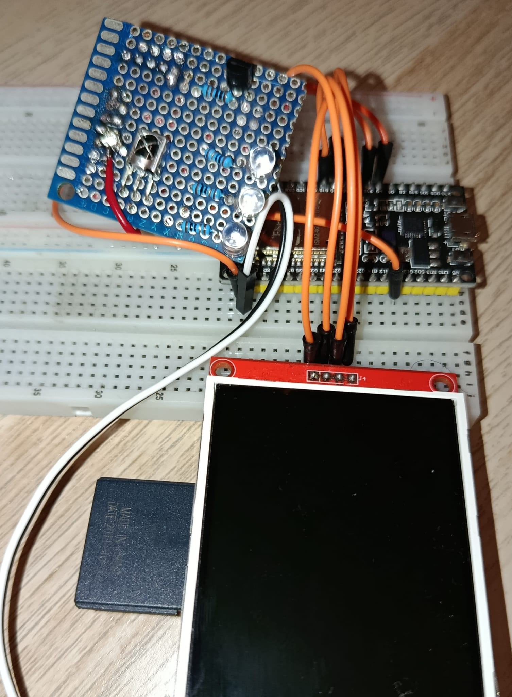
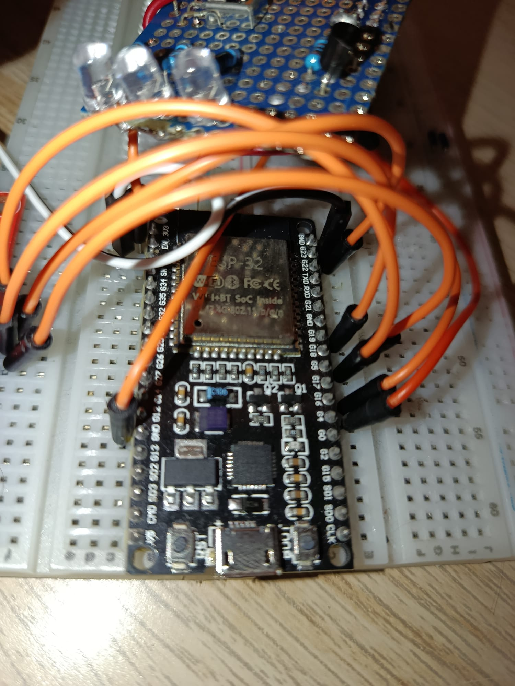

# IrBlaster-Api
An API powered by FASTAPI and Python that functions as a live database for ESP32 IR blasters with both network and local (SD card) saving and reading functions using a serial monitor. Also, it has each and every IR NEC code for the [Synetech Elite Taurus](https://synetechworld.com/en/pantallas-interactivas-educacion/taurus) interactive screen. 

### Libraries
#### Python 
+ fastapi
+ uvicorn
+ slowapi
+ pydantic

#### Platform IO
+ IRremote (by Armin Joachimsmeyer)
+ ArduinoJson (by Benoit Blanchon)
  
### Features
+ Read and decode IR remote signals (VS1838B receiver)
+ Store codes either locally (SD card) or over the network (FastAPI + persistent file storage)
+ Replay stored codes individually or by category, over serial commands
+ Multi-protocol support: NEC, Sony, Samsung, RC5, RC6, LG.
+ Duplicate code detection -- won't save the same code twice
+ Custom or auto-assigned IDs for saved codes
+ API secured with an API Key, rate-limited against abuse
+ Input validation on protocol and hex format

## Hardware
+ ESP32 WROOM (Recommended 38-pin version)
+ VS1838B IR receiver.
+ Ir Blaster Circuit
+ SD card module.

## Wiring (For ESP32 WROOM 38-PIN)

### VS1838B
| VS1838B | ESP32   |
|---------|---------|
| SIGNAL  | GPIO 04 |
| GND     | GND     |
| VCC     | 3.3V    | 

### SD card module
| SD Module |  ESP32  |
|-----------|---------|
| SD_CS     | GPIO 05 |
| SD_MOSI   | GPIO 23 |
| SD_MISO   | GPIO 19 | 
| SD_CLK    | GPIO 18 |
| GND       | GND     |
| VCC       | 3.3V    |

## IR Blaster Circuit

#### Hardware
+ 3x 5mm Ir LEDs
+ 2N2222A transistor
+ 1 kilo Ohm resistor
+ 3x 10 Ohm resistors

### Wiring
| From                 | To                             |
|----------------------|--------------------------------|
| ESP32 GPIO 16        | 1kΩ resistor → Transistor Base |   
| Transistor Base      | 2N2222A (Base pin)             |
| Transistor Collector | LED cathodes (all 3)           |
| Transistor Emitter   | GND                            |
| 3.3V                 | 10Ω resistor #1 -> LED 1 anode |
| 3.3V                 | 10Ω resistor #2 -> LED 2 anode |   
| 3.3V                 | 10Ω resistor #3 -> LED 3 anode |   

# My Setup





This is my setup as this is pretty easy to put everything together on a breadboard. I used a tft screen to get the Sd module setup.

## Setup
### API (Python)
````bash
git clone https://github.com/mrrobot0246/IrBlaster-Api
cd IrBlaster-Api
pip install -r requirements.txt   # fastapi, uvicorn, slowapi
uvicorn app:app --host 0.0.0.0 --port 8000
````
On first run, a new API key is generated automatically and printed to the console — copy it into the ESP32's config.h.

### ESP32 (PlatformIO)
1. Copy config.h.example to config.h
2. Fill in your WiFi credentials, API_BASE_URL (your API's address), and API_KEY (from the step above)
3. Build and upload via PlatformIO

### IR Code Example Files

Here are examples of both server-side and local-side IR code files. The local IR code file is this one: [ircodes_local.txt](ircodes_local.txt), and the Network IR Code file is this one: [ircodes.txt](ircodes.txt). These files include many types of IR codes, but especially they have all the [Synetech Elite Taurus](https://synetechworld.com/en/pantallas-interactivas-educacion/taurus) NEC codes.

### API Endpoints
|Method |Endpoint     |Description                                                          |
|-------|-------------|---------------------------------------------------------------------|
|POST   |/ircodes     |Add a new IR code                                                    |
|GET    |/ircodes     |List all codes (optional ?category= filter, skip/limit pagination)   |
|GET    |/ircodes/{id}| Get one code by ID                                                  |


### Serial Commands
|Command        |Description                                            |
|---------------|-------------------------------------------------------|
|read           |Capture an incoming IR code                            |
|receiveLocal   |Blast all codes saved on the SD card                   |
|receiveNetwork |Blast all codes saved on the server (network category) |
|sendNet        |Interactively list and pick a server code to blast     |
|sendNet <id>   |Blast a specific server code by ID                     |
|sendLoc        |Blast all SD card codes                                |
|sendLoc <id>   |Blast a specific SD card code by ID                    |


# Source
Seed codes for [ircodes.txt](ircodes.txt) and [ircodes_local.txt](ircodes_local.txt) were sourced from the irdb project, a crowd-sourced, open database of real IR remote codes.